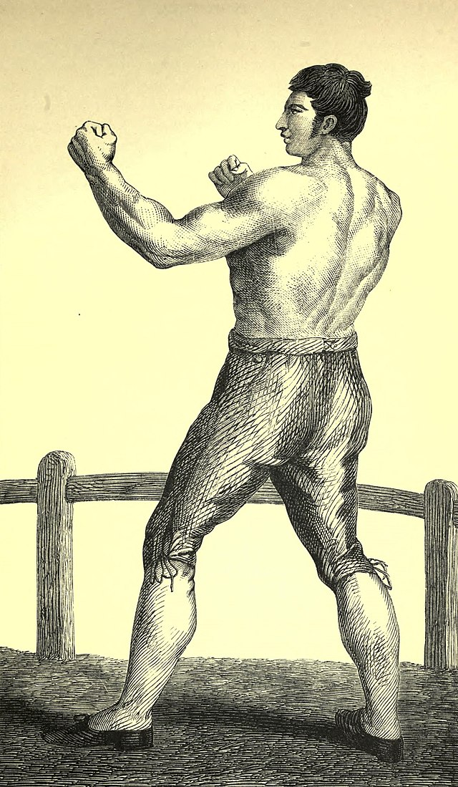

# A Child's Troika Alphabet Backgrounds
{: .no_toc }

*Backgrounds for a Child's Troika Alphabet*

## Backgrounds A-Z
{: .no_toc }
1. TOC
{:toc}

---

## Mad Maker of Merry Monsters 

---

You make monsters. Your friends are all monsters. You made all your friends.

**Possessions**
* Magic Monocle
* Mood Ring
* Materials
    * Metal
    * Matchsticks
    * Moss
    * Munchables
* Many Memories of Merry Monsters

**Advanced Skills**
* 3 Making
* 3 Monsters
* 2 Madness
* 1 Memories

**Special**

You can make a sentient monster out of any material; it can only be happy and a little crazy.

---

## Nowhere Nobody Nohow 

---

You are nothing (and everything), nowhere (so, everywhere), you cannot be harmed, you have no body, you are a non-thing, a nascent non-notion.

**Possessions**

* None

**Skills**

* 5 Nothing
* 4 Negation
* 3 N/A
* 2 Notions

**Special**

* Nothing.

---

## Pamphletting Pugilist of the People

---

They said you would come, a fighter for the workers, who’d punch more than just the clock, who could swing with words as well as fists!

**Possessions**

* Portable printing press
* Pretty paper
* Plenty of_ The Proletariat Primer _pamphlets
* Punching gloves
* Parrot

**Skills**

* 3 Pugilism
* 3 Pamphlet printing
* 2 Spell - Punch the clock
* 2 Punch-making

**Special**

Anyone you punch instantly supports the working class.

**Spell** : Punch the Clock (1)

You can punch a clock and stop time, releasing workers from their ordeal, while the capitalists remain bound to the yoke of time.

---

## Xylophage Xylophonist 

---

You are a giant termite. Like your ancestors, you are exceptionally good at eating wood, but you do have other hobbies….

**Possessions**
* Xylophone
* Xbox (damage as Club)
* X-ray machine
* X-ray collection

**Skills**
* 5 Xylophagia
* 1 Xylophone playing
* 1 Xbox playing
* 1 Xray tech

**Special**

Your name must start with “X”. If you choose “Xerxes” you must add “the [d100+23]”.

You can add any skills that start with “X”, but cannot surpass level 1 in any of them.
