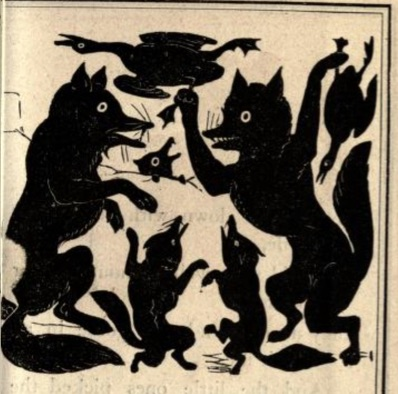

# A Child's Troika Alphabet Backgrounds
{: .no_toc }

An in-progress collection of alliterative Troika backgrounds to help young witches and wizards learn the alphabet.

Text is draft and subject to change. Background descriptions might become more uniform, sounding alliterative and poetic. Or not.

Public domain illustrations for now; goal is to have all backgrounds illustrated in a Victorian children's book style.

## Backgrounds A-Z
{: .no_toc }
1. TOC
{:toc}

---

## Dastardly Dealer of Delicious Dirt

---

Dirt, delicious, dirty dirt! 
You dig it. 
You dish it. 
You divine things from it. 
You get a bit dirty. 
Just how you like it.

**Possessions**

* Dirt
* Dirty jumpsuit
* Digging tools
* Divining rod (damage as Club)

**Advanced Skills**

* 3 Dirt (physical, all kinds, from all over the world)
* 3 Dirt (gossip, about everyone, everywhere)
* 2 Spell - Dirt Digestion
* 2 Dealmaking
* 1 Derring-do
* 1 Divining

**Special**

**Spell** - Dirt Digestion (2)

By eating a small sample of dirt, you can tell exactly where it came from and what secrets may have been uttered in its vicinity within the past week.

---

## Fantastic Fox Farmer

---

You are a fancy and fantastic fox farmer. You are also actually a Fox. You raise foxes to dance and fly and generally be fantastic.

**Possessions**

* 2d100 Foxes
* Fancy fineries
* Foxtrot records
* Flying machines
* Flyers for_ Fantastic Fox Farm’s Freaky Flying Foxes!_
* Fax machine

**Advanced Skills**

* 3 Foxes
* 2 Fox farming
* 2 Foxtrot
* 2 Flying
* 2 Flyering
* 1 Faxing

**Special**

**Fox-y Friends**

Other canines (wolves, dogs, etc) are hypnotized by your fancy and fantastical shows. When encountering any canine, you may Test Luck to convince them to join your retinue.

---

## Jill-of-all-Jacks

---

**Possessions**

* Jack (tool)
* Jackknife
* Jacks (game)
* Jack, apple (liqueur)
* _Journey’s Greatest Hits_

**Advanced Skills**

* 3 Jacking (of any type, carjacking, hijacking, dancing, jacking things up)
* 3 Spell - Jump In Jack Flash 
* 2 Jingles & Jangles
* 2 Jacks playing
* 1 Jackknife Fighting

**Special**

You have complete knowledge of every single person named Jack who has ever existed in any sphere.

**Spell**: Jump In Jack Flash

Drawing on your knowledge of a specific Jack, you morph your body into a completely accurate copy of them. Lasts for 1 hour. On a critical failed casting, you are stuck as this Jack for d66 days.

---

## Mad Maker of Merry Monsters 

---

You make monsters. Your friends are all monsters. You made all your friends.

**Possessions**
* A band of merry monsters (2d6)
* Magic Monocle
* Mood Ring
* Materials
    * Metal
    * Matchsticks
    * Moss
    * Munchables
* Many Memories of Merry Monsters

**Advanced Skills**
* 3 Making
* 3 Monsters
* 2 Madness
* 1 Memories

**Special**

You can make a sentient monster out of any material; it can only be happy and a little crazy.

---

## Nowhere Nobody Nohow 

---

You are nothing (and everything), nowhere (so, everywhere), you cannot be harmed, you have no body, you are a non-thing, a nascent non-notion.

**Possessions**

* None

**Advanced Skills**

* 5 Nothing
* 4 Negation
* 3 N/A
* 2 Notions

**Special**

* Nothing.

---

## Pamphletting Pugilist of the People

---

They said you would come, a fighter for the workers, who’d punch more than just the clock, who could swing with words as well as fists!

**Possessions**

* Portable printing press
* Pretty paper
* Plenty of *The Proletariat Primer* pamphlets
* Punching gloves
* Parrot

**Advanced Skills**

* 3 Pugilism
* 3 Pamphlet printing
* 2 Spell - Punch the clock
* 2 Punch-making

**Special**

Anyone you punch instantly supports the working class.

**Spell** : Punch the Clock (1)

You can punch a clock and stop time, releasing workers from their ordeal, while the capitalists remain bound to the yoke of time.

---

## Questing Questioner of the Quotidian

---

Quitting your quaint and quiet quadrant of the world, you picked up a quill and began your quest to query and question the status quo. It’s led to more than a few quarrels.  

**Possessions**

* Quick tongue
* Quill
* Question book
* Question mark(er)
* Quota of questions (daily)

**Skills**

* 3 Questioning
* 3 Questing
* 3 Quotidia
* 2 Quarreling

**Special**

You can say “I’m just asking the question” after asking a question, putting the target at -1 against attempts to harm you.

---
## Tiny Time Technician
---

You may be tiny, but your taming of time is truly tremendous.

**Possessions**

* Tiny timepieces
* Tiny tools in a tiny toolbox
* Time tree trimmers
* Time trap
* _The Three-Volume Tome of Tiny Time Taming. Time Tree Trimming & Time Trapping_

**Advanced Skills**

* 3 Time 
* 3 Time tooling
* 3 Time taming
* 2 Time trapping
* 2 Time tree trimming

**Special**

You can disassemble and fix any timepiece, and set it to any time. You always know exactly what time it is, down to the nanosecond.

---

## Xylophage Xylophonist 

---

You are a giant termite. Like your ancestors, you are exceptionally good at eating wood, but you do have other hobbies….

**Possessions**
* Xylophone
* Xbox (damage as Club)
* X-ray machine
* X-ray collection

**Advanced Skills**
* 5 Xylophagia
* 1 Xylophone playing
* 1 Xbox playing
* 1 Xray tech

**Special**

Your name must start with “X”. If you choose “Xerxes” you must add “the [d100+23]”.

You can add any skills that start with “X”, but cannot surpass level 1 in any of them.

*Thanks to [Thriftomancer](https://thriftomancer.itch.io/) for his insistence that the Troika alphabet include a giant termite Xylophage, and his input on the first draft of this background*
