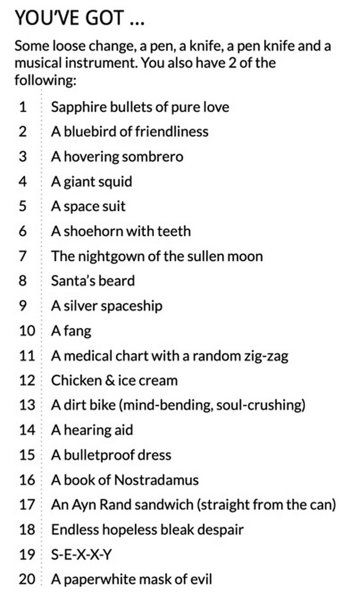

# They Might Be Troika!

<iframe frameborder="0" src="https://itch.io/embed/672247?bg_color=252624&amp;fg_color=f6f7f5&amp;link_color=4210ff&amp;border_color=363636" width="552" height="167"><a href="https://72stations.itch.io/they-might-be-troika">They Might Be Troika! by STATIONS</a></iframe>

When we discovered Troika we realized that it might just be **the perfect system** for creating a They Might Be Giants-based RPG experience. 

For the Troika! Pamphlet Adventure Jam, we assembled this sandbox full of possessions, locations, motivations, encounters and experiences drawn from the vast and strange world of They Might Be Giants songs. We even crammed in a few backgrounds and a spell!

